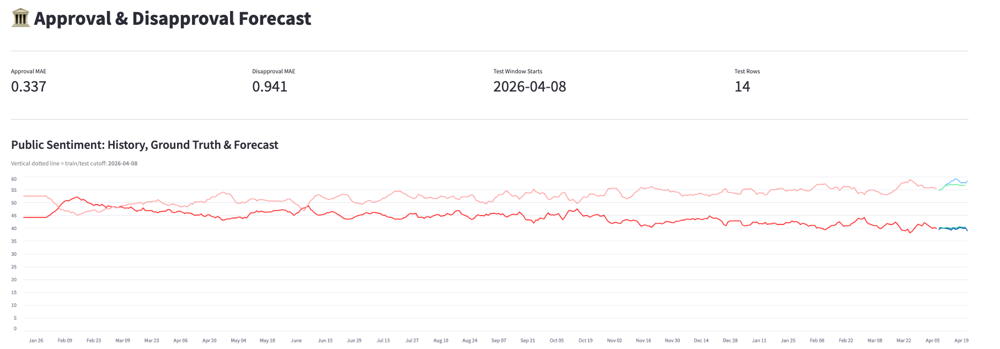

# US Presidential Approval Forecasting

A Master's-level Data Warehousing project that predicts US presidential approval and disapproval ratings by combining economic indicators, media sentiment, and polling data in a cloud-based medallion pipeline.



---

## What it does

The system ingests data from three public sources on a scheduled basis, stores and transforms it through a medallion warehouse architecture (Bronze → Silver → Gold), trains two XGBoost regression models (approval & disapproval), and surfaces the forecast in an interactive Streamlit dashboard.

Current model accuracy on held-out test data:
- **Approval MAE: 0.34 pp**
- **Disapproval MAE: 0.94 pp**

---

## Architecture

```
External APIs
  ├── FRED (economic indicators)
  ├── VoteHub (approval polls)
  └── GDELT (media sentiment)
         │
         ▼
  AWS Lambda (handler.py)
         │  fetches & uploads raw JSON
         ▼
  S3 (raw/)
         │
         ▼
  Snowflake
  ├── Bronze  — raw ingestion
  ├── Silver  — cleaning & normalisation
  └── Gold    — One Big Table (OBT) for modelling
         │
         ▼
  ML Models (XGBoost)
  ├── Approval forecast
  └── Disapproval forecast
         │
         ▼
  Streamlit dashboard
```

---

## Data Sources

| Source | What it provides | Auth |
|--------|-----------------|------|
| [FRED](https://fred.stlouisfed.org) | 30+ macroeconomic series (GDP, CPI, unemployment, S&P 500, …) | API key |
| [VoteHub](https://votehub.com) | Presidential approval/disapproval polls (≥ 500 respondents) | None |
| [GDELT 2.0](https://www.gdeltproject.org) | Daily media tone & article volume for US English news | None |

See [`dataset_description.md`](dataset_description.md) for full field-level documentation.

---

## Repository Layout

```
pipelines/
  lambda/
    handler.py              # AWS Lambda entry point
    fetch_sources/
      fred.py               # FRED fetcher
      gdelt.py              # GDELT fetcher (disk-cached)
      votehub.py            # VoteHub fetcher
  snowflake/                # SQL for Bronze/Silver/Gold layers
models/
  forecast_03.ipynb         # Training & evaluation notebook
streamlit/
  streamlit_app.py          # Interactive dashboard
src/
  analysis.ipynb            # Exploratory data analysis
screenshots/                # Dashboard screenshots
```

---

## Setup

```bash
python -m venv .venv
source .venv/bin/activate
pip install -r models/requirements.txt   # for notebooks / Streamlit
```

Required environment variables (copy `.env.example` to `.env`):

```
FRED_API_KEY=...
S3_BUCKET=...
S3_KEY_PREFIX=raw
S3_REGION=us-east-1
```

### Run the Streamlit app

```bash
streamlit run streamlit/streamlit_app.py
```

---

## Pipeline (Lambda)

The Lambda handler is triggered on a schedule. It fetches all three sources, caps the date range to today, and uploads one JSON file per source to S3:

```
s3://<S3_BUCKET>/raw/economic.json
s3://<S3_BUCKET>/raw/approval.json
s3://<S3_BUCKET>/raw/media_sentiment.json
```

Pass `{"debug": true}` in the event payload to use hardcoded dummy data without hitting external APIs.
